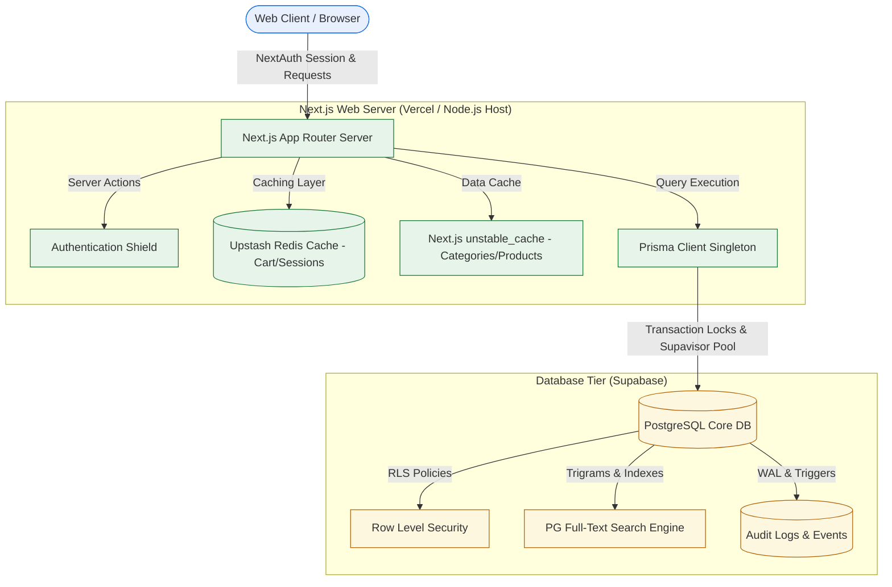
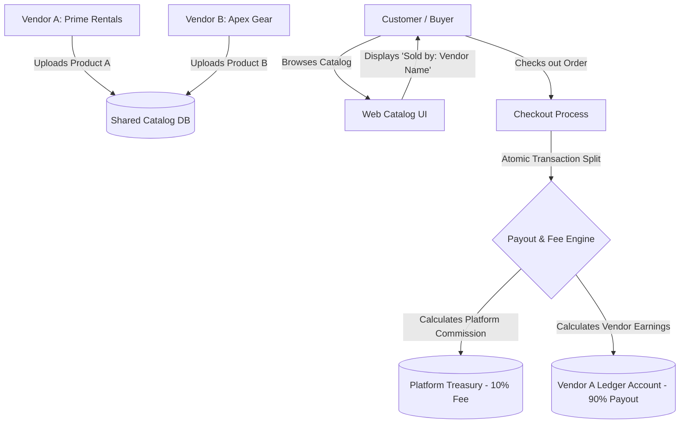

# System Design: Hall Rental SaaS Platform

This document describes the high-level system architecture and database design patterns used to support **10,000+ concurrent users** with Amazon/Flipkart level consistency, security, and performance on resource-constrained hosting (e.g. Supabase Free Tier).

---

## 🗺️ High-Level System Architecture



---

## 💎 The Five Architectural Pillars

### Pillar 1: Atomic Booking System (Consistency)
To guarantee that two users cannot book the same hall for the same slot (preventing double-bookings), the system uses **PostgreSQL Row-level Locks & ACID Transactions** via Prisma.

* **Database Constraints:** 
  A unique constraint on `HallAvailability` ensures PostgreSQL naturally rejects overlapping dates:
  ```prisma
  @@unique([productId, bookingDate, timeSlot])
  ```
* **Transactional Flow:**
  When a user books a hall, the server initiates an atomic Prisma transaction (`prisma.$transaction`). It attempts to write a record to `HallAvailability`. If another user is writing to the same slot, the database blocks the second writer. If the first transaction succeeds, the second one fails and returns a descriptive error message to the customer.

---

### Pillar 2: Session & Shopping Carts (High Speed Caching)
To scale up to 10,000+ users without overloading the database, session tokens and carts are cached.
* **Session Cache:** Managed via NextAuth with JWT strategies.
* **Cart Isolation:** Carts are stored locally in the browser cookie/localStorage, which eliminates database reads during browsing. When the user checks out, the cart is transferred to the database as a single transaction.

---

### Pillar 3: Trigram Full-Text Search (Flipkart-Style Searching)
Instead of setting up an expensive external search engine (like Elasticsearch), we utilize PostgreSQL's built-in full-text search capabilities:
* **Indexed Queries:** We index the `name` and `description` of the halls.
* **Fuzzy Matching:** Using Postgres Trigram search (`pg_trgm`), users can make typos (e.g., searching for *"halls in Dehli with AC"* instead of *"Delhi"*) and the search engine still identifies the correct halls.
* **Implementation:** The search Server Action queries product ID matches using a custom pg_trgm similarity query (`prisma.$queryRaw`) before performing Prisma filtering.

---

### Pillar 4: Row-Level Security (RLS) & Audit Logging (SaaS Security)
* **Row-Level Security (RLS):** Supabase acts as a security barrier. Even if a malicious actor bypasses the Next.js frontend, database policies prevent access:
  ```sql
  CREATE POLICY "Vendors can manage own products" 
  ON "Product" FOR ALL 
  USING (auth.uid() = vendorId);
  ```
* **Audit Trail:** Any modification to pricing, approval statuses, or user roles writes a record to the `AuditLog` table. This provides a complete ledger for tracking operations.

---

### Pillar 5: High-Concurrency Scaling & Connection Pooling
To prevent crashing on the Supabase Free Tier under 10,000+ concurrent requests, we enforce connection limits and data caching rules:

#### A. Database Connection Pooler (Supavisor)
Prisma is configured to query PostgreSQL through Supabase's transaction pooler (port `6543`), limiting active serverless connections to a small queue:
* **`DATABASE_URL` (Pooler String):** Configured on port `6543` with `?pgbouncer=true&connection_limit=10` appended.
* **`DIRECT_URL` (Direct Connection):** Configured on port `5432` for running migrations (`prisma migrate deploy`).

#### B. Single Client Singleton (`src/lib/prisma.ts`)
To prevent serverless routes from instantiating multiple database clients under traffic spikes, we cache the client inside `globalThis` in development and use a single export in production.

#### C. Aggressive Query Caching (`next/cache`)
To prevent 10,000 browsing users from overloading the PostgreSQL database, public page read queries are cached using Next.js `unstable_cache` with a 60-second revalidation TTL:
* **Category List:** Cached globally across the catalog page.
* **Product Details:** Cached individually by ID in the detail view.
* **Cache Revalidation:** Product updates, deletions, and additions trigger instant revalidation (`revalidatePath("/products")` and `revalidatePath("/products/[id]")`) so users see updates instantly without waiting for the 60-second TTL to expire.

---

## 🏬 Multi-Vendor Marketplace (Amazon/Flipkart Style Architecture)

To operate exactly like Amazon and Flipkart, the system is designed to isolate multiple independent sellers (Vendors) while offering a unified catalog and search interface to buyers (Customers).



### 1. Database Entity Separation
Every inventory item is tied directly to its owner. In the database schema:
* **Vendor Identity:** Users with `role = "VENDOR"` represent independent sellers. They have profile extensions like `companyName`, `gstin`, and custom `commissionRate`.
* **Inventory Linkage:** The `Product` model holds a relational key `vendorId` pointing back to the specific vendor:
  ```prisma
  model Product {
    id          String   @id @default(uuid())
    vendorId    String?  
    vendor      User?    @relation(fields: [vendorId], references: [id])
    ...
  }
  ```

### 2. Marketplace Payout & Fee Engine
When a customer rents items, they pay the platform unified total. During checkout verification inside `confirmBooking`, the transaction engine automatically splits the capital:
* **Dynamic Commission Rates:** Each vendor can have a customized commission rate (e.g. 10% standard, or 15% for premium sellers) stored in `User.commissionRate`.
* **Calculated Split:** For every product line item:
  * $\text{Platform Cut} = \text{Subtotal} \times \frac{\text{commissionRate}}{100}$
  * $\text{Vendor Payout} = \text{Subtotal} - \text{Platform Cut}$
* **Ledger Record:** The payout splits are stored directly in `RentalOrder.platformFee` and `RentalOrder.vendorPayout` to ensure audits and accounting reports compile instantly.

### 3. Tenant Dashboard Isolation
To secure seller data, access rules are strictly segmented:
* **Customer view:** Customers see all items from different vendors mixed together in the catalog, but each item shows a **"Sold by: [Vendor Company Name]"** banner (just like Amazon's seller tag).
* **Vendor view:** When a vendor logs into `/dashboard/vendor`, queries are constrained to their unique vendor identity:
  ```typescript
  const products = await prisma.product.findMany({
    where: { vendorId: currentVendorId }
  });
  ```
  This prevents vendors from viewing, modifying, or deleting other vendors' products or orders.
